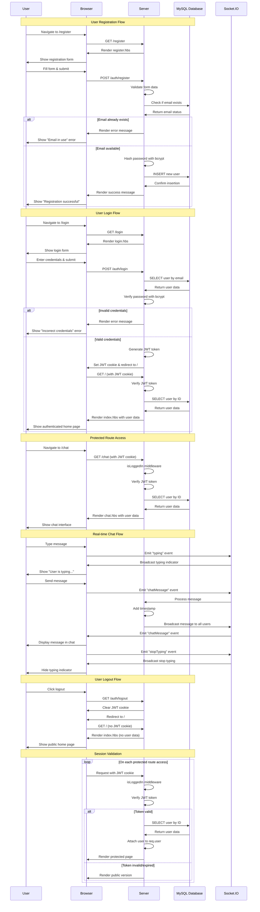

```mermaid
sequenceDiagram
    participant U as User
    participant B as Browser
    participant S as Server
    participant DB as MySQL Database
    participant SIO as Socket.IO

    Note over U,DB: User Registration Flow
    U->>B: Navigate to /register
    B->>S: GET /register
    S->>B: Render register.hbs
    B->>U: Show registration form
    U->>B: Fill form & submit
    B->>S: POST /auth/register
    S->>S: Validate form data
    S->>DB: Check if email exists
    DB->>S: Return email status
    alt Email already exists
        S->>B: Render error message
        B->>U: Show "Email in use" error
    else Email available
        S->>S: Hash password with bcrypt
        S->>DB: INSERT new user
        DB->>S: Confirm insertion
        S->>B: Render success message
        B->>U: Show "Registration successful"
    end

    Note over U,DB: User Login Flow
    U->>B: Navigate to /login
    B->>S: GET /login
    S->>B: Render login.hbs
    B->>U: Show login form
    U->>B: Enter credentials & submit
    B->>S: POST /auth/login
    S->>DB: SELECT user by email
    DB->>S: Return user data
    S->>S: Verify password with bcrypt
    alt Invalid credentials
        S->>B: Render error message
        B->>U: Show "Incorrect credentials" error
    else Valid credentials
        S->>S: Generate JWT token
        S->>B: Set JWT cookie & redirect to /
        B->>S: GET / (with JWT cookie)
        S->>S: Verify JWT token
        S->>DB: SELECT user by ID
        DB->>S: Return user data
        S->>B: Render index.hbs with user data
        B->>U: Show authenticated home page
    end

    Note over U,DB: Protected Route Access
    U->>B: Navigate to /chat
    B->>S: GET /chat (with JWT cookie)
    S->>S: isLoggedIn middleware
    S->>S: Verify JWT token
    S->>DB: SELECT user by ID
    DB->>S: Return user data
    S->>B: Render chat.hbs with user data
    B->>U: Show chat interface

    Note over U,DB: Real-time Chat Flow
    U->>B: Type message
    B->>SIO: Emit "typing" event
    SIO->>B: Broadcast typing indicator
    B->>U: Show "User is typing..."
    U->>B: Send message
    B->>SIO: Emit "chatMessage" event
    SIO->>S: Process message
    S->>S: Add timestamp
    S->>SIO: Broadcast message to all users
    SIO->>B: Emit "chatMessage" event
    B->>U: Display message in chat
    B->>SIO: Emit "stopTyping" event
    SIO->>B: Broadcast stop typing
    B->>U: Hide typing indicator

    Note over U,DB: User Logout Flow
    U->>B: Click logout
    B->>S: GET /auth/logout
    S->>B: Clear JWT cookie
    S->>B: Redirect to /
    B->>S: GET / (no JWT cookie)
    S->>B: Render index.hbs (no user data)
    B->>U: Show public home page

    Note over U,DB: Session Validation
    loop On each protected route access
        B->>S: Request with JWT cookie
        S->>S: isLoggedIn middleware
        S->>S: Verify JWT token
        alt Token valid
            S->>DB: SELECT user by ID
            DB->>S: Return user data
            S->>S: Attach user to req.user
            S->>B: Render protected page
        else Token invalid/expired
            S->>B: Render public version
        end
    end
```