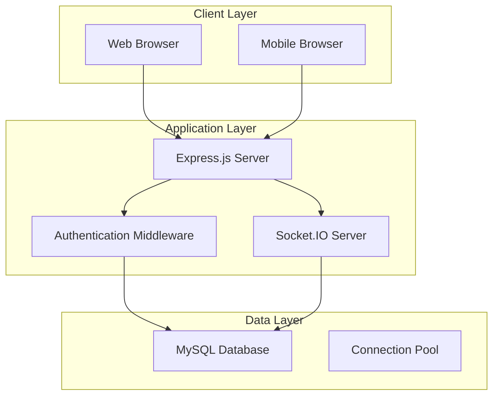
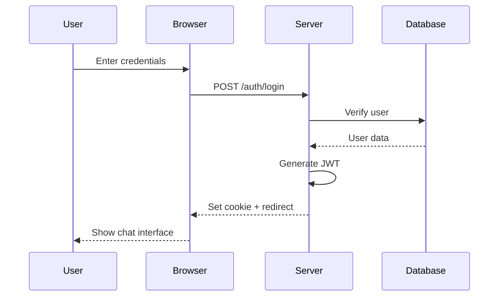
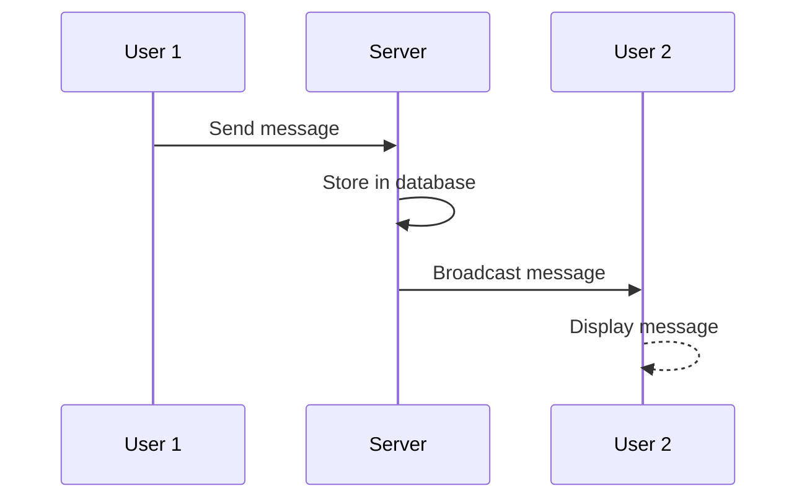
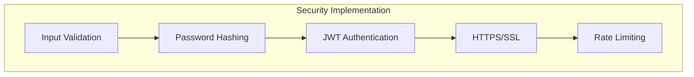
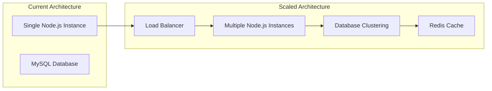
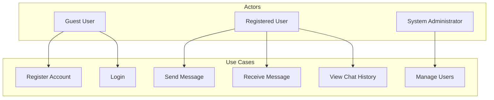
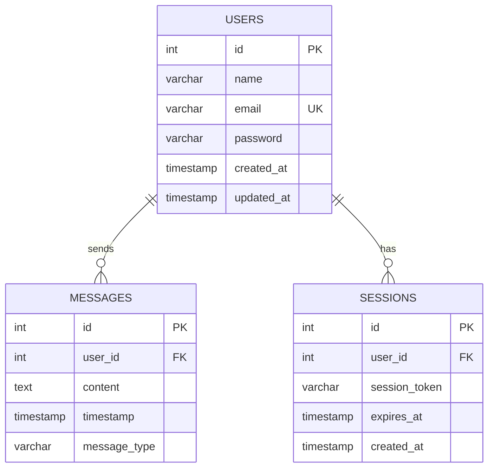
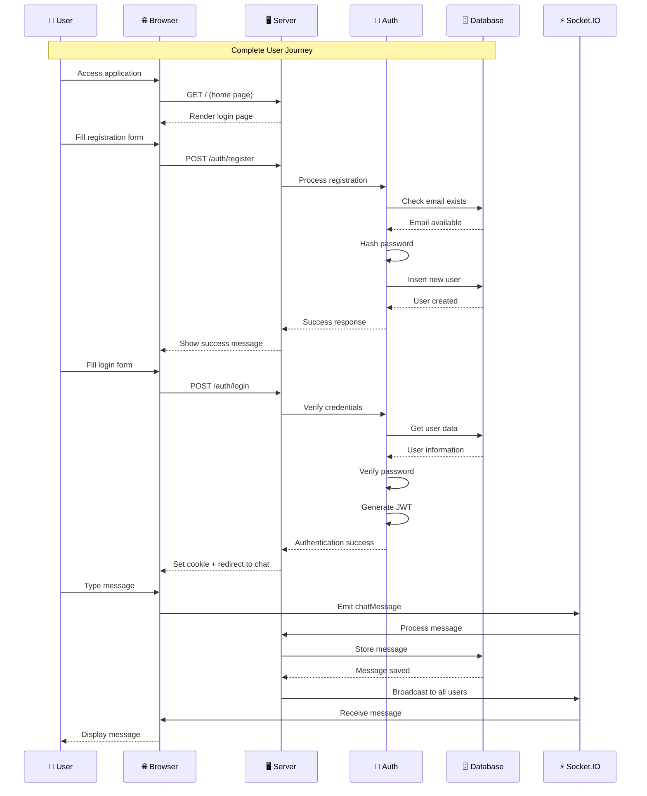

# Node.js MySQL Chat Application - Presentation Outline

## 🎯 **1. Project Gap and Scope**

### Current Market Analysis
- **Problem Statement**: Need for real-time, secure chat applications
- **Market Gap**: Limited open-source chat solutions with MySQL backend
- **Scope**: Build a production-ready chat application with authentication

### Project Objectives
- Real-time messaging using Socket.IO
- Secure user authentication with JWT
- MySQL database for data persistence
- Responsive web interface
- Scalable architecture for production use

---

## 📋 **2. Project Planning and Initiation**

### Project Goals
- **Primary**: Create a secure, real-time chat application
- **Secondary**: Demonstrate modern web development practices
- **Tertiary**: Provide a foundation for enterprise chat solutions

### Success Criteria
- User registration and login functionality
- Real-time message delivery
- Secure password handling
- Mobile-responsive design
- Database persistence

---

## 🔍 **3. Feasibility Study**

### Technical Feasibility
- ✅ **Node.js**: Mature ecosystem, extensive libraries
- ✅ **Express.js**: Proven web framework
- ✅ **Socket.IO**: Industry-standard real-time communication
- ✅ **MySQL**: Reliable, widely-used database
- ✅ **JWT**: Secure authentication standard

### Resource Requirements
- **Development Time**: 4-6 weeks
- **Team Size**: 2-3 developers
- **Infrastructure**: Local development + cloud deployment
- **Dependencies**: Open-source libraries

---

## 👥 **4. Target User**

### Primary Users
- **Developers**: Learning real-time web development
- **Small Teams**: Internal communication tool
- **Students**: Academic projects and portfolios
- **Startups**: MVP chat solution

### User Personas
- **Alex (Developer)**: Wants to learn Socket.IO and real-time features
- **Sarah (Team Lead)**: Needs simple team communication tool
- **Mike (Student)**: Building portfolio projects

---

## 📅 **5. Project Scheduling**

### Development Phases
```
Week 1-2: Project Setup & Authentication
├── Database design
├── User registration/login
└── JWT implementation

Week 3-4: Real-time Chat Features
├── Socket.IO integration
├── Message handling
└── User interface

Week 5-6: Testing & Deployment
├── Security testing
├── Performance optimization
└── Production deployment
```

### Milestones
- **M1**: Authentication system complete
- **M2**: Real-time chat functional
- **M3**: Production-ready application

---

## ⚙️ **6. Functional Requirements**

### Core Features
1. **User Management**
   - User registration with email validation
   - Secure login with JWT tokens
   - Password reset functionality

2. **Real-time Chat**
   - Instant message delivery
   - Typing indicators
   - Online/offline status
   - Message history

3. **Security Features**
   - Password hashing with bcrypt
   - JWT token authentication
   - Input validation and sanitization
   - CSRF protection

### Non-Functional Requirements
- **Performance**: < 100ms message delivery
- **Scalability**: Support 100+ concurrent users
- **Security**: OWASP compliance
- **Availability**: 99.9% uptime

---

## 🏗️ **7. System Architecture Diagram**

### High-Level Architecture


### Key Components
- **Frontend**: HTML5, CSS3, Vanilla JavaScript
- **Backend**: Node.js, Express.js, Socket.IO
- **Database**: MySQL with connection pooling
- **Authentication**: JWT + bcrypt

---

## 🔄 **8. System Workflow – Sequence Diagram**

### User Authentication Flow


### Real-time Chat Flow


---

## 🛠️ **9. Technology Stack**

### Frontend Technologies
- **HTML5**: Semantic markup
- **CSS3**: Responsive design, animations
- **JavaScript**: ES6+ features, DOM manipulation
- **Handlebars**: Server-side templating

### Backend Technologies
- **Node.js**: JavaScript runtime
- **Express.js**: Web framework
- **Socket.IO**: Real-time communication
- **JWT**: Authentication tokens

### Database & Security
- **MySQL**: Relational database
- **bcrypt**: Password hashing
- **dotenv**: Environment management
- **cookie-parser**: Session handling

### Development Tools
- **nodemon**: Auto-restart development
- **ESLint**: Code quality
- **Prettier**: Code formatting

---

## 🔒 **10. Security Architecture Diagram**

### Security Layers


### Security Features
- **Authentication**: JWT tokens with expiration
- **Authorization**: Role-based access control
- **Data Protection**: Password hashing, input sanitization
- **Network Security**: HTTPS, CORS configuration

---

## 📈 **11. Performance & Scalability Diagram**

### Scalability Strategy


### Performance Optimizations
- **Database**: Connection pooling, query optimization
- **Caching**: Redis for session storage
- **Load Balancing**: NGINX for traffic distribution
- **CDN**: Static asset delivery

---

## 🚀 **12. Project Boilerplate**

### Project Structure
```
node-mysql/
├── client/           # Frontend assets
├── server/           # Backend code
├── config/           # Configuration files
├── controllers/      # Business logic
├── routes/           # API endpoints
└── package.json      # Dependencies
```

### Key Files
- **app.js**: Main server file
- **db.js**: Database configuration
- **auth.js**: Authentication controller
- **chat.js**: Real-time chat logic

---

## 👤 **13. Use Case Diagram**

### System Actors and Use Cases


### Use Case Descriptions
- **Register Account**: Create new user profile
- **Login**: Authenticate existing user
- **Send Message**: Post message to chat
- **Receive Message**: Get real-time updates
- **View History**: Access previous messages
- **Manage Users**: Admin user management

---

## 🗄️ **14. ER Diagram**

### Database Schema


### Table Relationships
- **Users** → **Messages**: One-to-many (user sends multiple messages)
- **Users** → **Sessions**: One-to-many (user can have multiple sessions)
- **Primary Keys**: Auto-incrementing IDs
- **Foreign Keys**: Referential integrity

---

## 🔄 **15. Sequence Diagram (Detailed)**

### Complete System Flow


---

## 📊 **16. Presentation Summary**

### Key Takeaways
1. **Modern Architecture**: Node.js + Express + Socket.IO
2. **Security First**: JWT + bcrypt + input validation
3. **Real-time Features**: Instant messaging with Socket.IO
4. **Scalable Design**: Production-ready architecture
5. **Best Practices**: Industry-standard development tools

### Next Steps
- **Development**: Implement core features
- **Testing**: Security and performance testing
- **Deployment**: Production environment setup
- **Monitoring**: Performance and error tracking

---

## 🎯 **17. Q&A Section**

### Common Questions
- **Q**: Why Node.js over other technologies?
- **A**: JavaScript ecosystem, real-time capabilities, rapid development

- **Q**: How do you ensure security?
- **A**: JWT tokens, password hashing, input validation, HTTPS

- **Q**: Can this scale to enterprise use?
- **A**: Yes, with load balancing, clustering, and caching

---

## 📚 **18. References & Resources**

### Documentation
- [Node.js Official Docs](https://nodejs.org/docs/)
- [Express.js Guide](https://expressjs.com/)
- [Socket.IO Documentation](https://socket.io/docs/)
- [MySQL Documentation](https://dev.mysql.com/doc/)

### Learning Resources
- Real-time web development tutorials
- JWT authentication best practices
- MySQL performance optimization
- Web security guidelines

---

*This presentation outline provides a comprehensive overview of your Node.js MySQL Chat Application project, covering all technical aspects from architecture to implementation details.*

