# Node.js MySQL Authentication System - Sequence Diagram

This document contains a Mermaid sequence diagram that illustrates the complete flow of the authentication system, including user registration, login, protected routes, real-time chat, and session management.

## Sequence Diagram

```mermaid
sequenceDiagram
    participant U as User
    participant B as Browser
    participant S as Server
    participant DB as MySQL Database
    participant SIO as Socket.IO

    Note over U,DB: User Registration Flow
    U->>B: Navigate to /register
    B->>S: GET /register
    S->>B: Render register.hbs
    B->>U: Show registration form
    U->>B: Fill form & submit
    B->>S: POST /auth/register
    S->>S: Validate form data
    S->>DB: Check if email exists
    DB->>S: Return email status
    alt Email already exists
        S->>B: Render error message
        B->>U: Show "Email in use" error
    else Email available
        S->>S: Hash password with bcrypt
        S->>DB: INSERT new user
        DB->>S: Confirm insertion
        S->>B: Render success message
        B->>U: Show "Registration successful"
    end

    Note over U,DB: User Login Flow
    U->>B: Navigate to /login
    B->>S: GET /login
    S->>B: Render login.hbs
    B->>U: Show login form
    U->>B: Enter credentials & submit
    B->>S: POST /auth/login
    S->>DB: SELECT user by email
    DB->>S: Return user data
    S->>S: Verify password with bcrypt
    alt Invalid credentials
        S->>B: Render error message
        B->>U: Show "Incorrect credentials" error
    else Valid credentials
        S->>S: Generate JWT token
        S->>B: Set JWT cookie & redirect to /
        B->>S: GET / (with JWT cookie)
        S->>S: Verify JWT token
        S->>DB: SELECT user by ID
        DB->>S: Return user data
        S->>B: Render index.hbs with user data
        B->>U: Show authenticated home page
    end

    Note over U,DB: Protected Route Access
    U->>B: Navigate to /chat
    B->>S: GET /chat (with JWT cookie)
    S->>S: isLoggedIn middleware
    S->>S: Verify JWT token
    S->>DB: SELECT user by ID
    DB->>S: Return user data
    S->>B: Render chat.hbs with user data
    B->>U: Show chat interface

    Note over U,DB: Real-time Chat Flow
    U->>B: Type message
    B->>SIO: Emit "typing" event
    SIO->>B: Broadcast typing indicator
    B->>U: Show "User is typing..."
    U->>B: Send message
    B->>SIO: Emit "chatMessage" event
    SIO->>S: Process message
    S->>S: Add timestamp
    S->>SIO: Broadcast message to all users
    SIO->>B: Emit "chatMessage" event
    B->>U: Display message in chat
    B->>SIO: Emit "stopTyping" event
    SIO->>B: Broadcast stop typing
    B->>U: Hide typing indicator

    Note over U,DB: User Logout Flow
    U->>B: Click logout
    B->>S: GET /auth/logout
    S->>B: Clear JWT cookie
    S->>B: Redirect to /
    B->>S: GET / (no JWT cookie)
    S->>B: Render index.hbs (no user data)
    B->>U: Show public home page

    Note over U,DB: Session Validation
    loop On each protected route access
        B->>S: Request with JWT cookie
        S->>S: isLoggedIn middleware
        S->>S: Verify JWT token
        alt Token valid
            S->>DB: SELECT user by ID
            DB->>S: Return user data
            S->>S: Attach user to req.user
            S->>B: Render protected page
        else Token invalid/expired
            S->>B: Render public version
        end
    end
```

## How to Use This Diagram

### Option 1: View in GitHub
GitHub automatically renders Mermaid diagrams in Markdown files. Simply push this file to your repository and view it on GitHub.

### Option 2: View in VS Code
Install the "Markdown Preview Mermaid Support" extension to view Mermaid diagrams directly in VS Code.

### Option 3: Convert to Image
Use online Mermaid tools like:
- [Mermaid Live Editor](https://mermaid.live/)
- [Mermaid Chart](https://www.mermaidchart.com/)

### Option 4: Use in Documentation
Include this diagram in your project documentation, README files, or technical specifications.

## Diagram Components

The diagram shows the interaction between:

- **User (U)**: End user interacting with the system
- **Browser (B)**: Client-side handling and rendering
- **Server (S)**: Express.js server with middleware and controllers
- **MySQL Database (DB)**: User data storage and retrieval
- **Socket.IO (SIO)**: Real-time communication for chat features

## Key Flows Documented

1. **User Registration**: Complete registration process with validation
2. **User Login**: Authentication with JWT token generation
3. **Protected Routes**: Middleware-based route protection
4. **Real-time Chat**: Socket.IO implementation details
5. **User Logout**: Session cleanup process
6. **Session Validation**: Continuous authentication verification

This diagram serves as a comprehensive reference for understanding the system architecture and data flow.

