# Full System Design - Node.js MySQL Chat Application

## System Overview
This is a real-time chat application built with Node.js, Express, MySQL, and Socket.IO. The system provides user authentication, real-time messaging, and a responsive web interface.

## Architecture Diagram

## Data Flow Sequence Diagram

```mermaid
sequenceDiagram
    participant User as 👤 User
    participant Browser as 🌐 Browser
    participant Server as 🖥️ Express Server
    participant Auth as 🔐 Auth Controller
    participant DB as 🗄️ MySQL Database
    participant Socket as ⚡ Socket.IO
    participant JWT as 🎫 JWT Service
    
    Note over User,DB: User Registration Flow
    User->>Browser: Fill registration form
    Browser->>Server: POST /auth/register
    Server->>Auth: Call register function
    Auth->>DB: Check if email exists
    DB-->>Auth: Email not found
    Auth->>Auth: Hash password with bcrypt
    Auth->>DB: INSERT new user
    DB-->>Auth: User created
    Auth-->>Server: Success response
    Server-->>Browser: Render success page
    Browser-->>User: Show success message
    
    Note over User,DB: User Login Flow
    User->>Browser: Fill login form
    Browser->>Server: POST /auth/login
    Server->>Auth: Call login function
    Auth->>DB: SELECT user by email
    DB-->>Auth: User data
    Auth->>Auth: Verify password hash
    Auth->>JWT: Generate JWT token
    JWT-->>Auth: JWT token
    Auth->>Server: Set cookie with JWT
    Server-->>Browser: Redirect to chat
    Browser-->>User: Show chat interface
    
    Note over User,DB: Real-time Chat Flow
    User->>Browser: Type message
    Browser->>Socket: Emit chatMessage
    Socket->>Server: Process message
    Server->>DB: Store message
    DB-->>Server: Message saved
    Server->>Socket: Broadcast to all users
    Socket->>Browser: Receive message
    Browser-->>User: Display message
```

## Database Schema

## Component Architecture

## Deployment Architecture

## Security Architecture

## Performance & Scalability

## Technology Stack

## Key Features & Capabilities

- **Real-time Chat**: Instant messaging using Socket.IO
- **User Authentication**: Secure login/registration with JWT
- **Password Security**: bcrypt hashing for password protection
- **Session Management**: Cookie-based authentication
- **Responsive Design**: Mobile-friendly interface
- **Database Persistence**: MySQL for data storage
- **Template Engine**: Handlebars for dynamic content
- **Static File Serving**: Efficient asset delivery
- **Error Handling**: Comprehensive error management
- **Logging**: Request and error logging

## System Requirements

- **Node.js**: v14+ recommended
- **MySQL**: v8.0+ recommended
- **Memory**: 512MB+ RAM
- **Storage**: 1GB+ disk space
- **Network**: HTTP/HTTPS support
- **OS**: Cross-platform (Windows, Linux, macOS)

This system design provides a comprehensive overview of your Node.js MySQL chat application, covering architecture, data flow, security, scalability, and deployment considerations.

